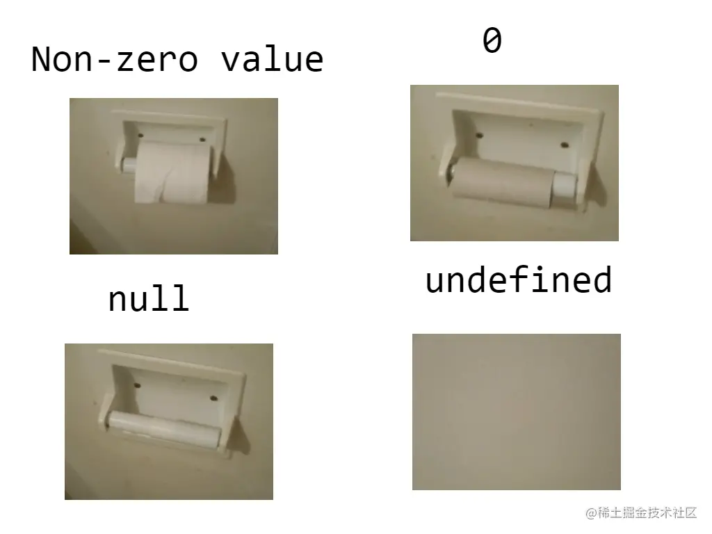

### js数据类型
#### 基础数据类型
  > 7种 Boolean Number String undefined null Bigint Symbol
  ##### Bigint
  JavaScript 所有数字都保存成 64 位浮点数，这给数值的表示带来了两大限制。一是数值的精度只能到 53 个二进制位（相当于 16 个十进制位），大于这个范围的整数，JavaScript 是无法精确表示，这使得 JavaScript 不适合进行科学和金融方面的精确计算。二是大于或等于2的1024次方的数值，JavaScript 无法表示，会返回Infinity。
    ```
     // 超过 53 个二进制位的数值，无法保持精度
     Math.pow(2, 53) === Math.pow(2, 53) + 1 // true

     // 超过 2 的 1024 次方的数值，无法表示
     Math.pow(2, 1024) // Infinity
    ```
  新的数据类型 BigInt（大整数），来解决这个问题，这是 ECMAScript 的第八种数据类型。BigInt 只用来表示整数，没有位数的限制，任何位数的整数都可以精确表示。
    ```
      const a = 2172141653n;
      const b = 15346349309n;

      // BigInt 可以保持精度
      a * b // 33334444555566667777n

      // 普通整数无法保持精度
      Number(a) * Number(b) // 33334444555566670000
    ```
  为了与 Number 类型区别，BigInt 类型的数据必须添加后缀n。
  BigInt 同样可以使用各种进制表示，都要加上后缀n。
    ```
      1234 // 普通整数
      1234n // BigInt

      // BigInt 的运算
      1n + 2n // 3n

      0b1101n // 二进制
      0o777n // 八进制
      0xFFn // 十六进制
    ```
  BigInt 与普通整数是两种值，它们之间并不相等。
    `42n === 42 // false`
  typeof运算符对于 BigInt 类型的数据返回bigint。
    `typeof 123n // 'bigint'`
  BigInt 可以使用负号（-），但是不能使用正号（+），因为会与 asm.js 冲突。
    ```
      -42n // 正确
      +42n // 报错
    ```
  JavaScript 原生提供BigInt函数，可以用它生成 **Bigint** 类型的数值。转换规则基本与Number()一致，将其他类型的值转为 **Bigint**。
    ```
      BigInt(123) // 123n
      BigInt('123') // 123n
      BigInt(false) // 0n
      BigInt(true) // 1n

      // BigInt()函数必须有参数，而且参数必须可以正常转为数值，下面的用法都会报错。
      new BigInt() // TypeError
      BigInt(undefined) //TypeError
      BigInt(null) // TypeError
      BigInt('123n') // SyntaxError
      BigInt('abc') // SyntaxError
      
      // 参数如果是小数，也会报错。
      BigInt(1.5) // RangeError
      BigInt('1.5') // SyntaxError

      // BigInt 继承了 Object 对象的两个实例方法。
      BigInt.prototype.toString()
      BigInt.prototype.valueOf()

      // 继承了 Number 对象的一个实例方法。
      BigInt.prototype.toLocaleString()
    ```
  ##### null与undefined
  > 都代表为空，主要区别为 **undefined** 表示尚未初始化的变量的值，**null** 表示该变量有意缺少对象指向
  * undefined: 
    * 变量根本上未定义
    * 全局的一个属性，也就是说他是全局作用域的一个变量


  * null：
    * 定义了，但是没有指向任何内存中的对象
    * 并不是全局变量，是一个字面量
  

  ```
    typeof null  // 'object' null在存储时32位都为0，typeof判断类型时会取前三位，前三位为0时，返回object
    typeof undefined  // 'undefined'

    Object.prototype.toString.call(null)       // '[object Null]'
    Object.prototype.toString.call(undefined)  // '[object Undefined]'

    null == undefined  // true
    null === undefined  // false
    !!null === !!undefined  // true

    // JavaScript 中第一个对象的原型指向 null 。
    Object.getPrototypeOf(Object.prototype)  // null

    let a = undefined + 1  // NaN
    let b = null + 1  // 1
    Number(undefined)  // NaN
    Number(null)  // 0

    JSON.stringify({a: undefined})  // '{}'
    JSON.stringify({b: null})  // '{b: null}'
    JSON.stringify({a: undefined, b: null})  // '{b: null}'


    function test(n) {
      let undefined = 'test'
      return n === undefined
    }

    test()           // false
    test(undefined)  // false
    test('test')     // ture

    let undefined = 'test'  // Uncaught SyntaxError: Identifier 'undefined' has already been declared
  ```

  ##### Symbol
  > ES6 引入的一种新的原始值，表示独一无二的值，主要为了解决属性名冲突问题
  ```
    let s = Symbol(); // 不可使用new，因为他不是一个对象

    typeof s
    // "symbol"
  ```
  Symbol函数可以接受一个字符串作为参数，表示对 Symbol 实例的描述，主要是为了在控制台显示，或者转为字符串时，比较容易区分。
  ```
  let s1 = Symbol('foo');
  let s2 = Symbol('bar');

  s1 // Symbol(foo)
  s2 // Symbol(bar)

  s1.toString() // "Symbol(foo)"
  s2.toString() // "Symbol(bar)"

  ```
  Symbol函数的参数只是表示对当前 Symbol 值的描述，因此相同参数的Symbol函数的返回值是不相等的。

  Symbol 值也可以转为布尔值，但是不能转为数值。
  ```
  let sym = Symbol();
  Boolean(sym) // true
  !sym  // false

  if (sym) {
    // ...
  }

  Number(sym) // TypeError
  sym + 2 // TypeError
  ```
  ES2019提供了一个实例属性 **description**，可以直接返回Symbol的描述
  ```
  const sym = Symbol('foo');

  sym.description // "foo"
  ```

  **Symbol** 可以作为属性名，防止出现同名属性
  ```
  let mySymbol = Symbol();

  // 第一种写法
  let a = {};
  a[mySymbol] = 'Hello!';

  // 第二种写法
  let a = {
    [mySymbol]: 'Hello!'
  };

  // 第三种写法
  let a = {};
  Object.defineProperty(a, mySymbol, { value: 'Hello!' });

  // 以上写法都得到同样结果
  a[mySymbol] // "Hello!"
  ```
  在对象的内部，使用 Symbol 值定义属性时，Symbol 值必须放在方括号之中
  ```
  let s = Symbol();
  let a = Symbol()

  let obj = {
    [s]: function (arg) { ... },
    [a](arg) { ... }
  };

  obj[s](123);
  obj[a](123)
  ```
  ***Symbol 值作为属性名时，该属性还是公开属性，不是私有属性。***

  方法：
  ***Symbol.for*** 方法可以检测上下文中是否已经存在使用该方法且相同参数创建的 symbol 值，如果存在则返回已经存在的值，如果不存在则新建。
  ```
  const s1 = Symbol.for('foo');
  const s2 = Symbol.for('foo');

  console.log(s1 === s2); // true
  ```
  Symbol.keyFor 方法返回一个使用 Symbol.for 方法创建的 symbol 值的 key
  ```
  const foo = Symbol.for("foo");
  const key = Symbol.keyFor(foo);

  console.log(key) // "foo"
  ```

  用法：
  防止被覆盖：作为对象属性 当一个复杂对象中含有多个属性的时候，很容易将某个属性名覆盖掉，利用 Symbol 值作为属性名可以很好的避免这一现象。
  ```
  const name = Symbol('name');
  const obj = {
      [name]: 'ClickPaas',
  }
  ```
  缺点：会导致外部无法使用此方法，且每次运行的name都不同
  其余*symbol* 方法可查看[===>阮一峰es6-Symbol](https://es6.ruanyifeng.com/?search=bigint&x=0&y=0#docs/symbol)


#### 引用数据类型
  > 1种 Object对象（包括基础类型object、function、array、Data、regExp、Math）


### Promise
  > 
  > 解决了什么问题: 异步之间存在依赖关系，需要通过层层嵌套回调来满足这种依赖，如果嵌套层数过多，可读性和可维护性都变得很差，产生所谓“回调地狱”，而Promise将回调嵌套改为链式调用，增加可读性和可维护性

  > 三种状态，**Pending（等待状态）**、**Fulfilled（执行状态）**、**Rejected（拒绝状态）**，状态变更是单向的，状态不可逆，都是从Pending到剩下两个状态，一旦状态改变就会一直保持这个状态，称为**resolved（已定型）**

  > then方法可以接收两个可选参数, 第一个回调函数是Promise对象的状态变为resolved时调用，第二个回调函数是Promise对象的状态变为rejected时调用。这两个函数都是可选的，不一定要提供。它们都接受Promise对象传出的值作为参数
  ***观察者模式***
  > 收集依赖 -> 触发通知 -> 取出依赖执行
  > promise中，执行顺序是 then收集依赖 -> 异步触发resolve -> resolve执行依赖
  ```
    const p1 = new Promise((resolve, reject) => { // 立即执行
      setTimeout(() => { // setTimeout为宏任务，所以这一步为宏任务执行
          resolve('result')
      },
      1000);
    }) 
    // .then会进行提前依赖收集，等promise状态改变后才会在微队列中执行
    p1.then(res => console.log(res), err => console.log(err)) // 宏任务执行完成后，状态改变，会执行.then()中的微任务
  ```
  1. Promise对象接收一个回调函数，其中包含两个参数resolve和reject
  2. 创建Promise时，会立即执行这个回调函数
  3. 回调函数中使用resolve和reject将任务状态改变，分别推向.then和.catch中
  4. .then()被执行，收集失败和成功的回调，放入相应队列中
  5. setTimeout中的回调执行，将任务状态改变，.then()执行相应回调

  **Promise 新建后就会立即执行**
  ```
   let promise = new Promise(function(resolve, reject) {
     console.log('Promise');
     resolve();
   });

   promise.then(function() {
     console.log('resolved.');
   });

   console.log('Hi!');

   // Promise
   // Hi!
   // resolved

  ```
  Promise 新建后立即执行，所以首先输出的是Promise
  然后，then方法指定的回调函数，将在当前脚本所有同步任务执行完才会执行，所以resolved最后输出

  > 当一个异步操作（p1）的结果返回另一个异步操作（p2）时，p2的结果将会传递给p1，也就是说p2的状态决定了p1的状态；
    如果p2的状态为padding，则p1会等待p2的状态改变；
    如果p2的状态变为resolved或rejected，那么p1的回调函数会立刻执行
  ``` 
    const p2 = new Promise(function (resolve, reject) {
      // ...
    });

    const p1 = new Promise(function (resolve, reject) {
      // ...
      resolve(p2);
    })
  ```

  ```
   const p1 = new Promise(function (resolve, reject) {
     setTimeout(() => reject(new Error('fail')), 3000)
   })

   const p2 = new Promise(function (resolve, reject) {
     setTimeout(() => resolve(p1), 1000)
   })

   p2
     .then(result => console.log(result))
     .catch(error => console.log(error))

   // Error: fail
  ```
  > p1是一个 Promise，3 秒之后变为rejected。p2的状态在 1 秒之后改变，resolve方法返回的是p1。由于p2返回的是另一个 Promise，导致p2自己的状态无效了，由p1的状态决定p2的状态。所以，后面的then语句都变成针对后者（p1）。又过了 2 秒，p1变为rejected，导致触发catch方法指定的回调函数。

  ***注意：***  用resolve或reject并不会终结 Promise 的参数函数的执行
  ```
  new Promise((resolve, reject) => {
     resolve(1);
     console.log(2);
   }).then(r => {
     console.log(r);
   });
   // 2
   // 1
  ```
  调用resolve(1)以后，后面的console.log(2)还是会执行，并且会首先打印出来。这是因为立即 resolved 的 Promise 是在本轮事件循环的末尾执行，总是晚于本轮循环的同步任务
  > 一般来说，调用resolve或reject以后，Promise 的使命就完成了，后继操作应该放到then方法里面，而不应该直接写在resolve或reject的后面。所以，最好在它们前面加上return语句，这样就不会有意外
  ```
  new Promise((resolve, reject) => {
     return resolve(1);
     // 后面的语句不会执行
     console.log(2);
   })
  ```
