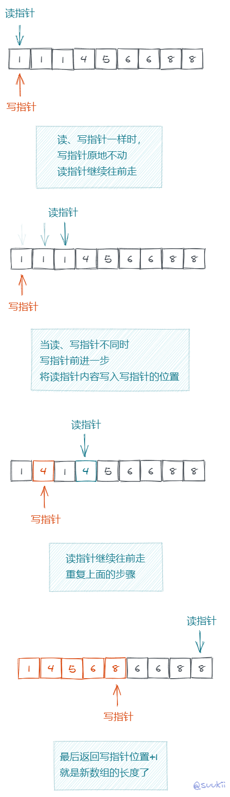
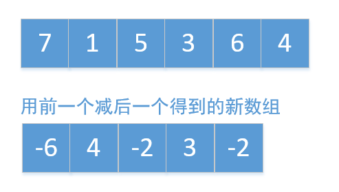
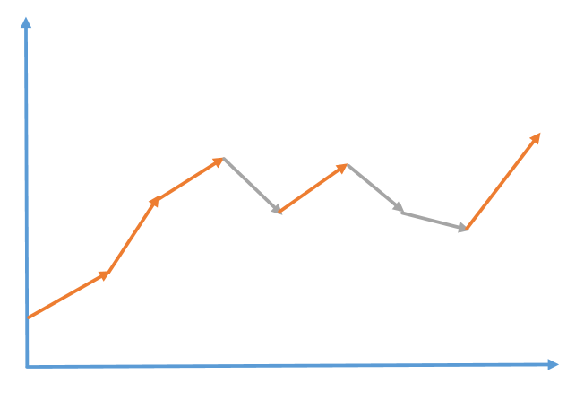

[toc]
### 删除排序数组中的重复项
  > 给定一个排序数组，你需要在 原地 删除重复出现的元素，使得每个元素只出现一次，返回移除后数组的新长度。

    不要使用额外的数组空间，你必须在 原地 修改输入数组 并在使用 O(1) 额外空间的条件下完成。

    示例 1:

    给定数组 nums = [1,1,2],

    函数应该返回新的长度 2, 并且原数组 nums 的前两个元素被修改为 1, 2。

    你不需要考虑数组中超出新长度后面的元素。
    示例 2:

    给定 nums = [0,0,1,1,1,2,2,3,3,4],

    函数应该返回新的长度 5, 并且原数组 nums 的前五个元素被修改为 0, 1, 2, 3, 4。

    你不需要考虑数组中超出新长度后面的元素。


    说明:

    为什么返回数值是整数，但输出的答案是数组呢?

    请注意，输入数组是以「引用」方式传递的，这意味着在函数里修改输入数组对于调用者是可见的。

    你可以想象内部操作如下:

    // nums 是以“引用”方式传递的。也就是说，不对实参做任何拷贝
    int len = removeDuplicates(nums);

    // 在函数里修改输入数组对于调用者是可见的。
    // 根据你的函数返回的长度, 它会打印出数组中该长度范围内的所有元素。
    for (int i = 0; i < len; i++) {
        print(nums[i]);
    }
  * 用一个读指针，一个写指针遍历数组
  * 遇到重复元素时，读指针就继续前移
  * 遇到不同元素时，写指针就前移一步，写入元素

 

 ### 股票最优时机（贪心算法）
 > 给你一个整数数组 prices ，其中 prices[i] 表示某支股票第 i 天的价格。
  在每一天，你可以决定是否购买和/或出售股票。你在任何时候 最多 只能持有 一股 股票。你也可以先购买，然后在 同一天 出售。
  返回 你能获得的 最大 利润 。
 
 示例 1：

  ```
  输入：prices = [7,1,5,3,6,4]
  输出：7
  解释：在第 2 天（股票价格 = 1）的时候买入，在第 3 天（股票价格 = 5）的时候卖出, 这笔交易所能获得利润 = 5 - 1 = 4 。
       随后，在第 4 天（股票价格 = 3）的时候买入，在第 5 天（股票价格 = 6）的时候卖出, 这笔交易所能获得利润 = 6 - 3 = 3 。
      总利润为 4 + 3 = 7 。
  ```
  示例 2：
  ```
  输入：prices = [1,2,3,4,5]
  输出：4
  解释：在第 1 天（股票价格 = 1）的时候买入，在第 5 天 （股票价格 = 5）的时候卖出, 这笔交易所能获得利润 = 5 - 1 = 4 。
       总利润为 4 。
  ```
  示例 3：
  ```
  输入：prices = [7,6,4,3,1]
  输出：0
  解释：在这种情况下, 交易无法获得正利润，所以不参与交易可以获得最大利润，最大利润为 0 。
  ```
  **贪心算法**
  > 贪心算法是指，在对问题求解时，总是做出在当前看来是最好的选择。也就是说，不从整体最优上加以考虑，算法得到的是在某种意义上的局部最优解。
    那么这道题使用贪心算法也是最容易解决的，只要是上涨的我们就要计算他们的差值进行累加，不需要再找开始上涨的最小值和最大值。为什么能这样计算，我举个例子。
    比如a<b<c<d，因为从a到d一直是上涨的，那么最大值和最小值的差值就是d-a，也可以写成(b-a)+(c-b)+(d-c)，搞懂了这个公式所有的一切都明白了。如果还不明白，可以想象成数组中前一个值减去后一个值，构成一个新的数组，我们只需要计算这个新数组中正数的和即可，这里以示例1为例画个图看下

    
  
  这里只需要计算新数组中正数的和，也就是4+3=7

  下面一个股票的曲线图，可以看到如果股票一直上涨，只需要找到股票上涨的最大值和股票开始上涨的最小值，计算他们的差就是这段时间内股票的最大利润。如果股票下跌就不用计算，最终只需要把所有股票上涨的时间段内的利润累加就是我们所要求的结果
  
  ```
    const maxProfit = (prices:number[])=>{
      let num:number = 0
      let list:number[] = []
      list = prices.map((i:number, index:number) => {
        return prices[1 + index] - i
      })
      list.forEach((i:number)=>{
        if(i>=0) {
          num += i
        }
      })
      return num
    }
  ```
 